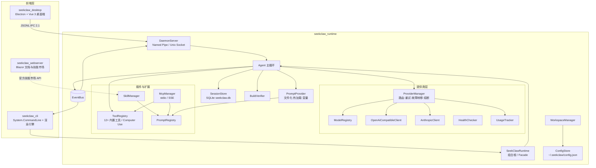

<p align="center">
  
</p>

<h1 align="center">SeekClaw</h1>

<div align="center">

[](https://opensource.org/licenses/MIT)
[](https://dotnet.microsoft.com/)
[](https://www.npmjs.com/package/seekclaw-cli)
[](https://github.com/umr-xiaomai/SeekClaw/stargazers)
[](https://github.com/umr-xiaomai/SeekClaw/network/members)
[](https://github.com/umr-xiaomai/SeekClaw/issues)
[](https://github.com/umr-xiaomai/SeekClaw/pulls)
[](https://github.com/umr-xiaomai/SeekClaw/actions)

**现代化、高性能的 AI Agent 运行时**

SeekClaw 是基于 .NET 10.0 构建的高性能 AI Agent 运行时，采用清洁架构和事件驱动设计。它为构建 AI 驱动的编码助手提供了完整平台，支持多 LLM 提供商、工具执行、会话管理和流畅的终端交互体验。

[🌐 官方网站与文档](https://seekclaw.hoilai.com) •
[English](README_EN.md) •
[界面预览](#-界面预览) •
[快速开始](#-安装) •
[功能特性](#-功能特性) •
[贡献指南](#-贡献指南)

</div>

<p align="center">
  
</p>

## 📸 界面预览

### 桌面端

| AI 对话与项目管理 | 模型与 Provider 管理 |
| :---: | :---: |
|  |  |

| Runtime 诊断与用量 | MCP Server 配置 |
| :---: | :---: |
|  |  |

### 终端

| 终端流式输出与思考推理 | 代码生成与文档编写 |
| :---: | :---: |
|  |  |

| 工具调用与网络搜索验证 | 提供商与模型路由管理 |
| :---: | :---: |
|  |  |

## ✨ 功能特性

### 🚀 Runtime First 架构

- **清洁架构**：以 `seekclaw_runtime` 为核心，`seekclaw_cli` 作为默认前端，关注点分离
- **插件系统**：通过 Tools、Skills 和 MCP（Model Context Protocol）实现可扩展性
- **事件驱动**：通过事件总线实现渲染与业务逻辑解耦

### 🤖 多提供商支持

- **OpenAI 兼容**：GPT-5.5、GPT-5.5-mini 及所有 OpenAI 兼容 API
- **Anthropic**：Claude Opus、Claude Sonnet、Claude Haiku
- **Google**：Gemini Pro、Gemini Flash
- **本地模型**：Ollama、LM Studio
- **智能路由**：快速、均衡、质量、经济、离线等多种策略
- **故障转移**：自动重试、指数退避和熔断器机制

### 🛠️ 工具生态系统

- **内置工具**：文件操作（读/写/编辑）、搜索（grep/glob）、bash 执行
- **MCP 支持**：stdio 和 SSE 传输，自动发现工具/提示/资源
- **技能系统**：基于目录的技能系统，支持提示注入和工作流

### 💻 现代化终端体验

- **游戏式渲染**：30-60 FPS 刷新率，双缓冲技术
- **流式输出**：实时 token 流式传输，显示思考/推理过程
- **实时 UI**：加载动画、进度条、工具状态和 Markdown 渲染
- **增量更新**：无闪烁、无滚动、平滑动画

### 📁 工作区管理

- **项目识别**：自动识别 Git、.NET、Node.js、Python、Rust、Go、Unity、Vue 项目
- **隔离配置**：每个工作区独立的配置、缓存和内存，会话按工作区作用域隔离
- **自动初始化**：自动创建 `.seekclaw/` 目录结构

### 🔧 开发者体验

- **会话管理**：基于 SQLite 的会话持久化、恢复与并发访问
- **内存系统**：工作区特定的内存，自动上下文注入
- **验证机制**：代码修改后自动构建/检查/修复循环
- **热重载**：提示文件和配置无需重启即可重载

## 📦 安装与运行

### 方式一：使用 Desktop 桌面端（推荐）

SeekClaw Desktop 是功能完备的图形客户端（基于 Electron + Vue 3），内置自包含 .NET Runtime，**无需单独安装 .NET SDK** 即可开箱即用。

* **使用发布包**：下载解压 `SeekClaw-win-x64` 文件夹后，直接运行其中的 `SeekClaw.exe`。
* **从源码构建**：
  ```powershell
  git clone https://github.com/umr-xiaomai/SeekClaw.git
  cd SeekClaw
  build.cmd
  ```
  `build.cmd` 将自动安装前端依赖、构建自包含 Runtime 与 Electron 应用，产物输出于 `publish\SeekClaw-win-x64\SeekClaw.exe`。

### 方式二：通过 npm 安装 CLI

已发布到 npm 的 `seekclaw-cli` 是自包含 .NET 二进制包，安装后可直接使用，无需单独安装 .NET SDK（目前提供 Windows x64 平台二进制）：

前置要求：
- Node.js 18 或更高版本
- Git（用于工作区检测）

```powershell
npm install -g seekclaw-cli

# 验证安装
seekclaw --version

# 进入交互式聊天
seekclaw
```

也可以执行单次任务或恢复会话：

```powershell
seekclaw "解释这个项目的架构"
seekclaw --continue
seekclaw doctor
```

### 方式三：从源码运行 CLI

需要 .NET 10.0 SDK 与 Git：

```bash
git clone https://github.com/umr-xiaomai/SeekClaw.git
cd SeekClaw
dotnet build

# 交互式聊天模式
dotnet run --project seekclaw_cli

# 单次提示
dotnet run --project seekclaw_cli -- "解释这个项目的架构"

# 继续上一个会话
dotnet run --project seekclaw_cli -- --continue

# 恢复特定会话
dotnet run --project seekclaw_cli -- --resume <session-id>

# 覆盖模型
dotnet run --project seekclaw_cli -- --model "openai/gpt-5.5"
```

## 🏗️ 架构设计


```mermaid
flowchart TD
    subgraph Frontends[前端层]
        Desktop[seekclaw_desktop<br/>Electron + Vue 3 桌面端]
        CLI[seekclaw_cli<br/>System.CommandLine + 渲染引擎]
        Web[seekclaw_webserver<br/>Blazor 文档与技能市场]
    end

    subgraph Runtime[seekclaw_runtime]
        Facade[SeekClawRuntime<br/>组合根 / Facade]
        Agent[Agent 主循环]
        Bus[(EventBus)]
        DMN[DaemonServer<br/>Named Pipe / Unix Socket]
        subgraph Provider[提供商层]
            PM[ProviderManager<br/>路由·重试·故障转移·熔断]
            MR[ModelRegistry]
            OAI[OpenAiCompatibleClient]
            ANT[AnthropicClient]
            HC[HealthChecker]
            UT[UsageTracker]
        end
        subgraph Plugins[插件与扩展]
            TR[ToolRegistry<br/>12+ 内置工具 / Computer Use]
            PR[PromptRegistry]
            SK[SkillManager]
            MCP[McpManager<br/>stdio / SSE]
        end
        PP[PromptProvider<br/>文件化·热加载·变量]
        WS[WorkspaceManager]
        SS[SessionStore<br/>SQLite seekclaw.db]
        VF[BuildVerifier]
        CFG[ConfigStore<br/>~/.seekclaw/config.json]
    end

    Desktop -->|"JSONL IPC 2.1"| DMN
    Web -. 官方技能市场 API .-> SK
    CLI --> Facade
    DMN --> Agent
    Facade --> Agent
    Agent --> PM
    Agent --> TR
    Agent --> VF
    Agent --> SS
    Agent --> Bus
    PM --> MR
    PM --> OAI
    PM --> ANT
    PM --> UT
    SK --> PR
    MCP --> TR
    MCP --> PR
    Agent --> PP
    PP --> PR
    WS --> CFG
    Bus --> CLI
    Bus --> DMN
```

## 📁 项目结构

```text
SeekClaw/
├── seekclaw_desktop/       # 桌面客户端 (Electron + Vue 3)
│   ├── src/main/           # Electron 主进程、Daemon IPC 客户端、Computer Use 光环
│   ├── src/renderer/       # Vue 3 渲染进程（对话、项目、任务规划、设置中心）
│   └── package.json
├── seekclaw_cli/           # CLI 终端前端
│   ├── Commands/           # CLI 命令（provider、model、switch、doctor、skill、mcp 等）
│   ├── Ui/                 # 终端渲染引擎与 Ansi 双缓冲
│   └── Program.cs          # 入口点
├── seekclaw_runtime/       # 核心运行时引擎
│   ├── Agents/             # Agent 循环和上下文规划
│   ├── ComputerUse/        # 计算机交互扩展（屏幕捕获与动作）
│   ├── Configuration/      # 配置管理与版本迁移
│   ├── Coordination/       # 文件写锁协调器
│   ├── Daemon/             # 本地 IPC 服务端 (Named Pipe / Unix Socket)
│   ├── Events/             # 事件总线系统
│   ├── Mcp/                # MCP 客户端实现 (stdio / SSE / Streamable HTTP)
│   ├── Prompts/            # 提示加载、变量组合与热重载
│   ├── Providers/          # LLM 提供商集成与故障转移
│   ├── Sessions/           # 会话持久化 (SQLite seekclaw.db)
│   ├── Skills/             # 技能加载与市场安装
│   ├── SubAgents/          # 子智能体协调体系
│   ├── Tools/              # 内置工具 (文件、搜索、规划、命令、网络等)
│   ├── Verification/       # 自动构建验证与自愈循环
│   └── Workspaces/         # 工作区感知与项目类型检测
├── seekclaw_webserver/     # 官方网站、在线文档与技能市场中心 (Blazor)
├── seekclaw_tests/         # 运行时单元测试
├── seekclaw_cli_tests/     # CLI 单元测试
├── packaging/              # npm 与发布安装包分发定义
├── build.cmd / build.py    # 跨平台一键构建脚本 (Runtime + Desktop)
└── SeekClaw.slnx           # .NET 解决方案定义
```

## ⚙️ 配置

### 全局配置

位于 `~/.seekclaw/config.json`：

```json
{
  "provider": "openai",
  "model": "gpt-5.5",
  "temperature": 0.2,
  "providers": [
    {
      "id": "openai",
      "name": "OpenAI",
      "kind": "openai",
      "baseUrl": "https://api.openai.com/v1",
      "apiKey": "sk-...",
      "enabled": true,
      "priority": 1,
      "models": [
        {
          "id": "gpt-5.5",
          "contextWindow": 128000,
          "maxOutput": 8192
        }
      ]
    },
    {
      "id": "anthropic",
      "name": "Anthropic",
      "kind": "anthropic",
      "baseUrl": "https://api.anthropic.com",
      "apiKey": "sk-ant-...",
      "enabled": true,
      "priority": 2
    }
  ],
  "routing": {
    "failoverEnabled": true
  },
  "agent": {
    "maxSteps": 40,
    "maxRepairAttempts": 3,
    "autoVerify": true,
    "mode": "edit"
  }
}
```

### 工作区配置

每个项目可以在 `.seekclaw/config.json` 中覆盖：

- 提供商和模型选择（`provider`、`model`、`temperature`）
- Agent 模式与系统提示词（`mode`、`systemPrompt`）
- 技能与工具禁用列表（`disabledSkills`、`disabledTools`）
- 构建验证命令（`autoVerify`、`verifyCommand`）
- MCP 服务器设置

## 🎯 使用示例

### 交互式聊天

```bash
seekclaw
# 或
seekclaw chat
```

### 单次任务

```bash
seekclaw "将认证模块重构为使用 JWT"
seekclaw "为 UserService 类编写单元测试"
seekclaw "修复项目中的构建错误"
```

### 切换模型与 Provider

```bash
# 交互式切换 Provider 与模型
seekclaw switch

# 或直接激活指定模型/Provider
seekclaw model use openai/gpt-5.5
seekclaw provider use anthropic
```

### 提供商管理

```bash
seekclaw provider list
seekclaw provider add --id deepseek --kind openai --base-url "https://api.deepseek.com/v1" --api-key "sk-..." --model "deepseek-chat"
seekclaw provider test deepseek
```

### 模型管理

```bash
seekclaw model list
seekclaw model info claude-opus
seekclaw model search "快速编码模型"
seekclaw model test openai/gpt-5.5
```

### 会话管理

```bash
# 列出当前工作区的会话
seekclaw sessions

# 恢复上一次或指定会话
seekclaw --continue
seekclaw --resume <session-id>
```

会话数据和 Desktop 项目列表统一保存在 `~/.seekclaw/seekclaw.db`。升级后首次访问工作区时，旧的 JSONL 会话会自动导入，原文件保留为备份。Provider、模型、MCP、Skill、工作区配置保存在 JSON 文件，用量记录保存在 `~/.seekclaw/usage.jsonl`。

### 技能与 MCP 管理

```bash
# 技能管理（支持从官方技能市场或 URL 直接安装）
seekclaw skill list
seekclaw skill install code-review
seekclaw skill enable code-review

# MCP 管理
seekclaw mcp list
seekclaw mcp test
```

### 健康检查与用量

```bash
seekclaw doctor
seekclaw usage
seekclaw usage --days 7
```

## 🔌 扩展 SeekClaw

### 添加工具

实现 `ITool` 接口：

```csharp
public class MyTool : ITool
{
    public string Name => "my_tool";
    public string Description => "执行有用的操作";
    public JsonElement ParameterSchema => /* JSON schema */;
    public bool Mutating => false;
    public string StatusLabel => "正在运行我的工具";
    
    public async Task<ToolResult> ExecuteAsync(
        JsonObject args, ToolContext ctx, CancellationToken ct)
    {
        // 实现
    }
}
```

### 创建技能

在 `skills/` 目录中创建：

```
skills/
  my-skill/
    skill.yaml          # 元数据和配置
    prompt.txt          # 提示模板
    tools/              # 可选的工具实现
```

### MCP 服务器

在 `mcp/servers.json` 中配置：

```json
{
  "servers": {
    "my-server": {
      "command": "node",
      "args": ["path/to/server.js"],
      "transport": "stdio"
    }
  }
}
```

## 🧪 测试

```bash
# 运行所有测试
dotnet test seekclaw_tests

# 运行特定测试类
dotnet test seekclaw_tests --filter "ClassName=ProviderTests"
```

## 📊 监控

SeekClaw 包含内置监控：

- **使用统计**：Token 计数、成本、响应时间
- **健康检查**：提供商可用性和延迟
- **熔断器**：自动故障检测和恢复
- **会话分析**：对话历史和模式

## 🤝 贡献指南

1. Fork 本仓库
2. 创建功能分支 (`git checkout -b feature/amazing-feature`)
3. 提交更改 (`git commit -m '添加令人惊叹的功能'`)
4. 推送到分支 (`git push origin feature/amazing-feature`)
5. 创建 Pull Request

### 开发规范

- 遵循 SOLID 原则
- 保持清洁架构
- 为新功能编写单元测试
- 将提示存储在外部文件中（禁止硬编码字符串）
- 使用事件驱动模式进行 UI 更新

## 📄 许可证

本项目采用 MIT 许可证 - 查看 [LICENSE](LICENSE) 文件了解详情。

## 🙏 致谢

- 使用 .NET 10.0 和 System.CommandLine 构建
- 使用 Spectre.Console 进行终端渲染
- 遵循清洁架构和垂直切片模式
- 采用 Native AOT 友好的设计理念

---

**SeekClaw** - 基于现代化 .NET 的高性能 AI Agent 运行时。
