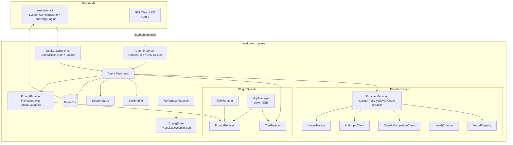

<p align="center">
  
</p>

<h1 align="center">SeekClaw</h1>

<div align="center">

[](https://opensource.org/licenses/MIT)
[](https://dotnet.microsoft.com/)
[](https://github.com/umr-xiaomai/SeekClaw/stargazers)
[](https://github.com/umr-xiaomai/SeekClaw/network/members)
[](https://github.com/umr-xiaomai/SeekClaw/issues)
[](https://github.com/umr-xiaomai/SeekClaw/pulls)
[](https://github.com/umr-xiaomai/SeekClaw/actions)

**Modern, High-Performance AI Agent Runtime**

SeekClaw is a high-performance AI agent runtime built on .NET 10.0, featuring clean architecture and event-driven design. It provides a complete platform for building AI-powered coding assistants with support for multiple LLM providers, tool execution, session management, and a smooth terminal interaction experience.

[🌐 Official Website & Docs](https://seekclaw.hoilai.com) •
[中文](README.md) •
[Screenshots](#-screenshots) •
[Getting Started](#-installation) •
[Features](#-features) •
[Contributing](#-contributing)

</div>

<p align="center">
  
</p>

## 📸 Screenshots

### Desktop

| AI Chat & Project Management | Model & Provider Management |
| :---: | :---: |
|  |  |

| Runtime Diagnostics & Usage | MCP Server Configuration |
| :---: | :---: |
|  |  |

### Terminal

| Streaming Output & Reasoning | Code Generation & Documentation |
| :---: | :---: |
|  |  |

| Tool Execution & Web Search | Provider & Model Management |
| :---: | :---: |
|  |  |

## ✨ Features

### 🚀 Runtime First Architecture

- **Clean Architecture**: Separation of concerns with `seekclaw_runtime` as the core and `seekclaw_cli` as the default frontend
- **Plugin System**: Extensible through Tools, Skills, and MCP (Model Context Protocol)
- **Event-Driven**: Decoupled rendering and business logic via event bus

### 🤖 Multi-Provider Support

- **OpenAI Compatible**: GPT-5.5, GPT-5.5-mini, and all OpenAI-compatible APIs
- **Anthropic**: Claude Opus, Claude Sonnet, Claude Haiku
- **Google**: Gemini Pro, Gemini Flash
- **Local Models**: Ollama, LM Studio
- **Routing**: Fast, Balanced, Quality, Cheap, Offline strategies
- **Failover**: Automatic retry with exponential backoff and circuit breaker

### 🛠️ Tool Ecosystem

- **Built-in Tools**: File operations (read/write/edit), search (grep/glob), bash execution
- **MCP Support**: stdio and SSE transports with automatic tool/prompt/resource discovery
- **Skills**: Directory-based skill system with prompt injection and workflow support

### 💻 Modern Terminal Experience

- **Game-style Rendering**: 30-60 FPS refresh with double buffering
- **Streaming Output**: Real-time token streaming with thinking/reasoning display
- **Live UI**: Spinner, progress bars, tool status, and markdown rendering
- **Incremental Updates**: No flickering, no scrolling, smooth animations

### 📁 Workspace Management

- **Project Detection**: Automatic recognition of Git, .NET, Node.js, Python, Rust, Go, Unity, Vue projects
- **Isolated Config**: Per-workspace configuration, sessions, cache, and memory
- **Bootstrap**: Automatic project setup with `.seekclaw/` directory structure

### 🔧 Developer Experience

- **Session Management**: JSONL-based session persistence and restoration
- **Memory System**: Workspace-specific memory with automatic context injection
- **Verification**: Automatic build/check/repair cycle after code modifications
- **Hot Reload**: Prompt files and configurations reload without restart

## 📦 Installation

### Prerequisites

- .NET 10.0 SDK or later
- Git (for workspace detection)

### Build from Source

```bash
git clone https://github.com/umr-xiaomai/SeekClaw.git
cd SeekClaw
dotnet build
```

### Run

```bash
# Interactive chat mode
dotnet run --project seekclaw_cli

# One-shot prompt
dotnet run --project seekclaw_cli -- "Explain the architecture of this project"

# Continue previous session
dotnet run --project seekclaw_cli -- --continue

# Resume specific session
dotnet run --project seekclaw_cli -- --resume <session-id>

# Override model
dotnet run --project seekclaw_cli -- --model "openai/gpt-5.5"
```

## 🏗️ Architecture



## 📁 Project Structure

```
SeekClaw/
├── seekclaw_cli/           # CLI frontend
│   ├── Commands/           # CLI commands (provider, model, profile, etc.)
│   ├── Ui/                 # Terminal rendering engine
│   └── Program.cs          # Entry point
├── seekclaw_runtime/       # Core runtime
│   ├── Agents/             # Agent loop and context planning
│   ├── Configuration/      # Config management
│   ├── Events/             # Event bus system
│   ├── Mcp/                # MCP client implementation
│   ├── Prompts/            # Prompt loading and composition
│   ├── Providers/          # LLM provider integrations
│   ├── Sessions/           # Session persistence
│   ├── Skills/             # Skill management
│   ├── Tools/              # Tool registry and implementations
│   ├── Verification/       # Build verification
│   └── Workspaces/         # Workspace detection and management
├── seekclaw_tests/         # Unit tests
├── docs/                   # Documentation
├── prompts/                # Prompt templates (future)
├── skills/                 # Skill definitions (future)
└── mcp/                    # MCP server configurations (future)
```

## ⚙️ Configuration

### Global Configuration

Located at `~/.seekclaw/config.json`:

```json
{
  "providers": {
    "openai": {
      "apiKey": "sk-...",
      "baseUrl": "https://api.openai.com/v1"
    },
    "anthropic": {
      "apiKey": "sk-ant-..."
    }
  },
  "profiles": {
    "default": {
      "provider": "openai",
      "model": "gpt-5.5"
    }
  },
  "agent": {
    "maxSteps": 10,
    "maxRepairAttempts": 3,
    "autoVerify": true
  }
}
```

### Workspace Configuration

Each project can have `.seekclaw/config.json` to override:

- Provider and model selection
- Temperature and context settings
- Tool permissions
- Skill configurations
- MCP server settings

## 🎯 Usage Examples

### Interactive Chat

```bash
seekclaw chat
# or simply
seekclaw
```

### One-shot Tasks

```bash
seekclaw "Refactor the authentication module to use JWT"
seekclaw "Write unit tests for the UserService class"
seekclaw "Fix the build errors in the project"
```

### Provider Management

```bash
seekclaw provider list
seekclaw provider add openai --api-key sk-...
seekclaw provider test openai
seekclaw provider use anthropic
```

### Model Management

```bash
seekclaw model list
seekclaw model use openai/gpt-5.5
seekclaw model info claude-opus
seekclaw model search "fast coding model"
```

### Session Management

```bash
seekclaw session list
seekclaw session resume <session-id>
seekclaw session export <session-id> --format json
```

### Health Check

```bash
seekclaw doctor
```

## 🔌 Extending SeekClaw

### Adding Tools

Implement the `ITool` interface:

```csharp
public class MyTool : ITool
{
    public string Name => "my_tool";
    public string Description => "Does something useful";
    public JsonElement ParameterSchema => /* JSON schema */;
    public bool Mutating => false;
    public string StatusLabel => "Running my tool";
    
    public async Task<ToolResult> ExecuteAsync(
        JsonObject args, ToolContext ctx, CancellationToken ct)
    {
        // Implementation
    }
}
```

### Creating Skills

Create a directory in `skills/`:

```
skills/
  my-skill/
    skill.yaml          # Metadata and configuration
    prompt.txt          # Prompt template
    tools/              # Optional tool implementations
```

### MCP Servers

Configure in `mcp/servers.json`:

```json
{
  "servers": {
    "my-server": {
      "command": "node",
      "args": ["path/to/server.js"],
      "transport": "stdio"
    }
  }
}
```

## 🧪 Testing

```bash
# Run all tests
dotnet test seekclaw_tests

# Run specific test class
dotnet test seekclaw_tests --filter "ClassName=ProviderTests"
```

## 📊 Monitoring

SeekClaw includes built-in monitoring:

- **Usage Tracking**: Token counts, costs, response times
- **Health Checks**: Provider availability and latency
- **Circuit Breaker**: Automatic failure detection and recovery
- **Session Analytics**: Conversation history and patterns

## 🤝 Contributing

1. Fork the repository
2. Create a feature branch (`git checkout -b feature/amazing-feature`)
3. Commit your changes (`git commit -m 'Add amazing feature'`)
4. Push to the branch (`git push origin feature/amazing-feature`)
5. Open a Pull Request

### Development Guidelines

- Follow SOLID principles
- Maintain clean architecture
- Write unit tests for new features
- Keep prompts in external files (no hardcoded strings)
- Use event-driven patterns for UI updates

## 📄 License

This project is licensed under the MIT License - see the [LICENSE](LICENSE) file for details.

## 🙏 Acknowledgments

- Built with .NET 10.0 and System.CommandLine
- Uses Spectre.Console for terminal rendering
- Follows clean architecture and vertical slice patterns
- Designed with Native AOT compatibility in mind

---

**SeekClaw** - A modern, high-performance AI agent runtime built on .NET.
