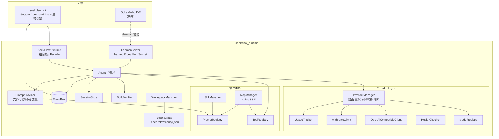
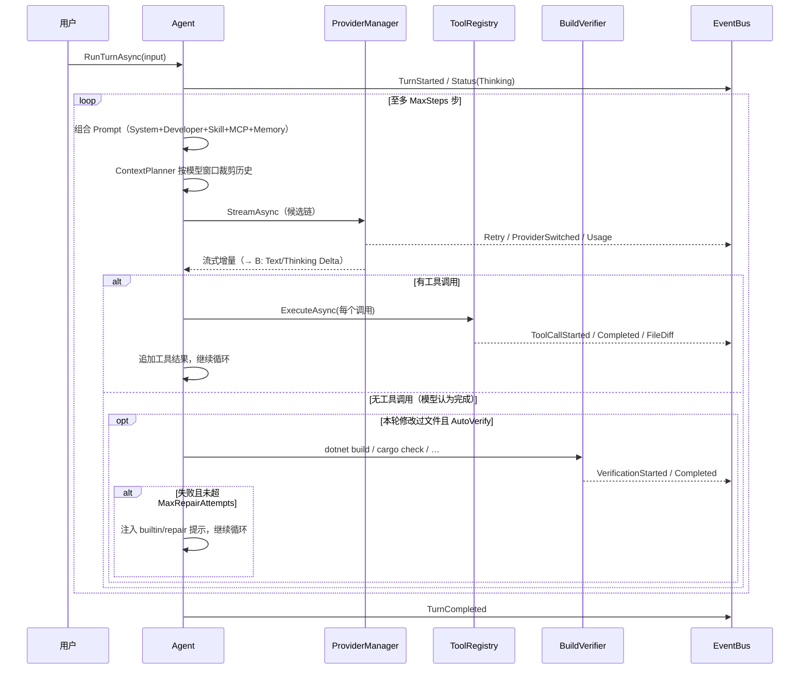

# SeekClaw 架构设计

> Runtime First：所有业务能力位于 `seekclaw_runtime`；`seekclaw_cli` 只是默认前端。
> 未来 GUI / Web / 移动端通过同一 Runtime Facade 或 Daemon 协议接入。

## 总体架构



## 渲染架构（游戏式刷新模型）


- Runtime / Tool / Provider **一律不写 Console**，只发布事件。
- 渲染线程每帧合并（coalesce）积压事件，单次写入终端，避免闪烁与滚屏。
- 已完成内容进入 scrollback；进行中的 Spinner / Thinking / Tool 状态 / 流式尾部 / 状态栏在底部 Live 区原地刷新。
- Ctrl+C：第一次取消当前任务，第二次（2 秒内或空闲时）退出。

## Agent 生命周期（一个 Turn）



## 模块划分

| 模块 | 目录 | 职责 |
|---|---|---|
| Events | `Events/` | `IEventBus`：Channel 发布订阅，渲染与业务解耦 |
| Configuration | `Configuration/` | `IConfigStore`：`~/.seekclaw/config.json` + `state.json`，首启从 `defaults/config.default.json` 种子化；JSON 源生成（AOT 友好） |
| Providers | `Providers/` | `IProviderManager` / `IModelRegistry` / `ILlmClient`（openai + anthropic 协议）/ `IUsageTracker` / `IHealthChecker` / `CircuitBreaker` |
| Prompts | `Prompts/` | `IPromptProvider`（文件加载·缓存·FileSystemWatcher 热更新·`{{var}}` 替换）/ `IPromptRegistry` / `PromptComposer` |
| Tools | `Tools/` | `ITool` / `IToolRegistry` + 内置工具（read_file / write_file / edit_file / list_dir / glob / grep / bash） |
| Agents | `Agents/` | `Agent` 主循环、`ContextPlanner`（上下文自适应） |
| Sessions | `Sessions/` | `ISessionStore`：JSONL 持久化、恢复、列表 |
| Workspaces | `Workspaces/` | `IWorkspaceManager`：项目识别（git/.NET/Node/Python/Rust/Go/Unity/Vue）、Bootstrap、Memory |
| Skills | `Skills/` | `ISkillManager`：目录化 skill.yaml + prompt.txt，启用/禁用，Prompt 注入 |
| Mcp | `Mcp/` | `IMcpManager` / `McpClient`：JSON-RPC 2.0，stdio + SSE 传输（HTTP/WS 预留），Tool/Prompt/Resource 自动发现 |
| Verification | `Verification/` | `IVerifier`：按项目类型选择构建命令，失败输出回注修复循环 |
| Daemon | `Daemon/` | Named Pipe（Windows）/ Unix Socket，行分隔 JSON 协议 |
| Facade | `SeekClawRuntime.cs` | 组合根 + DI 注册（`AddSeekClawRuntime`） |

## 关键接口

```csharp
IEventBus            { Publish(RuntimeEvent); Subscribe(): IEventSubscription }
IConfigStore         { Config; State; Save(); SaveState(); Reload() }
IProviderManager     { ResolveActive(ws?); BuildCandidates(ws?); StreamAsync(factory, ws, ct); TestModelAsync(model) }
IModelRegistry       { All(); Resolve(ref); Search(query) }
ILlmClient           { Kind; StreamAsync(LlmRequest, ct): IAsyncEnumerable<LlmStreamEvent> }
IUsageTracker        { Record(entry); ReadAll(since?); Aggregate(since?) }
IHealthChecker       { CheckAsync(provider) }
IPromptProvider      { TryGet(key); Get(key); Render(template, vars); SetWorkspaceRoot(dir) }
IPromptRegistry      { Register(PromptContribution): IDisposable; All }
ITool                { Name; Description; ParameterSchema; Mutating; StatusLabel; ExecuteAsync(args, ctx, ct) }
IToolRegistry        { Register(tool): IDisposable; Resolve(name); All }
IWorkspaceManager    { Detect(dir?); Bootstrap(ws); LoadMemory(ws) }
ISessionStore        { Create(ws); Load(ws, id); LoadLatest(ws); List(ws); Append(session, msg) }
ISkillManager        { Discover(ws); SetEnabled(name, on) }
IMcpManager          { ConnectAllAsync(ws, ct); LoadServerConfigs(ws); Status }
IVerifier            { ResolveCommand(ws); VerifyAsync(ws, ct) }
```

## 配置与数据（全部数据驱动）

```
~/.seekclaw/
    config.json      Provider / Model / Profile / Routing / Agent / MCP（首启种子化，可自由编辑）
    state.json       轮询游标、禁用技能等运行时状态
    usage.jsonl      每次调用的 token / 成本 / 延迟 / 成败
    prompts/         用户级 Prompt 覆盖
    skills/          全局技能

<workspace>/
    .seekclaw/       config.json（覆盖 Provider/Model/温度/权限/Skill/MCP/验证命令）
                     prompts/（工作区 Prompt 覆盖，优先级最高）
                     memory/MEMORY.md
    .session/        会话 JSONL
    .cache/  logs/  skills/  mcp/(servers.json)  docs/
```

Prompt 目录（应用自带，可被用户/工作区覆盖）：
`prompts/{system,developer,tool,workflow,builtin}/…​.txt`，支持 `{{workspace}} {{cwd}} {{project}} {{language}} {{model}} {{provider}} {{datetime}} {{os}} {{platform}} {{tool}} {{memory}}` 变量、热加载、按文件名做版本切换（如 `system/default-v2` 配到 `agent.systemPrompt`）。

## 路由 / 容错

- 候选链：Workspace 覆盖 → Profile 显式模型 → 策略列表（fast/balanced/quality/cheap/offline，支持 priority/roundRobin/leastUsed/lowestCost/fastest 负载均衡）→ 全局 fallback。
- 每候选最多 N 次重试（指数退避 + 抖动）；连续失败开熔断，冷却后半开。
- 首 token 到达后视为已提交，不再中途切换供应商。
- 能力驱动：业务层只看 `ModelCapabilities` 标志位，禁止 `if (model == "Claude")`。

## 开发计划（已完成 / 后续）

**已完成（本阶段）**：Runtime 全模块、CLI 全命令（provider/model/profile/usage/doctor/switch/init/skill/mcp/sessions/daemon/chat）、渲染引擎、29 项单元测试、仓库 Bootstrap。

**后续迭代建议**：
1. 上下文压缩：超窗时调用 `builtin/summarize` 生成摘要替代裁剪通知。
2. 权限系统：工具执行前的允许/询问/拒绝策略（workspace 可配）。
3. 增量索引：`.cache/` 中的符号索引，加速 grep/context 构建。
4. MCP HTTP / WebSocket 传输；MCP Resource 注入 Context。
5. Daemon 多客户端并发 + 会话路由；GUI 前端。
6. Prompt 本地化目录（`zh-CN/` `en-US/`）自动选择。
7. Native AOT 发布管线（当前代码已按 AOT 友好约束编写；Spectre/YamlDotNet 需验证裁剪）。
```
