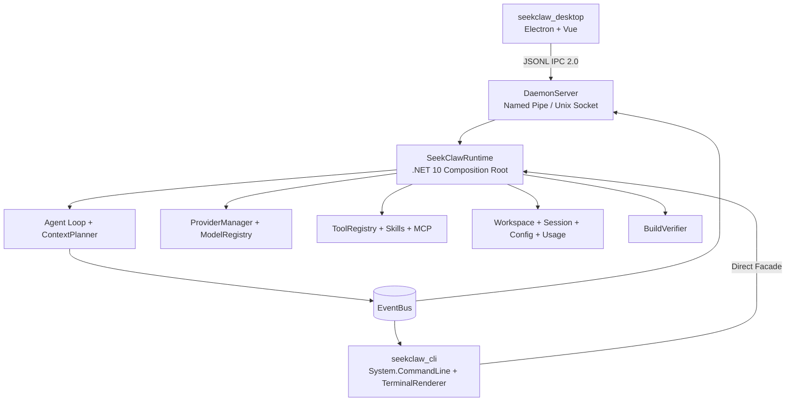
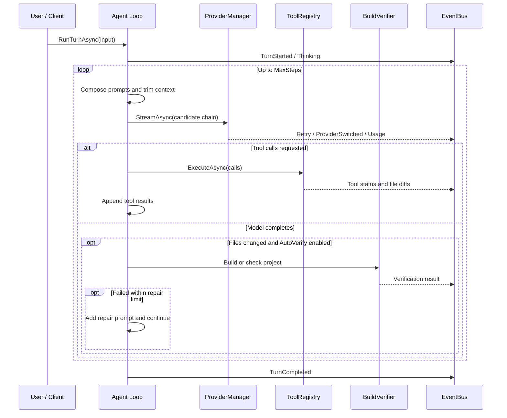

# Architecture and Runtime First Principles

SeekClaw follows a **Runtime First** and event-driven architecture. Desktop and CLI are both production clients: they reuse the same Runtime capabilities while owning the presentation concerns specific to a graphical or terminal interface.

## Overall architecture

## Runtime First principles

1. **Separation of concerns:** LLM routing, context planning, tool execution, session storage, and build verification live in `seekclaw_runtime`.
2. **No console coupling:** Runtime services publish typed events through `IEventBus` instead of writing UI output directly.
3. **Multiple clients:** `seekclaw_cli` uses the Runtime Facade directly, while `seekclaw_desktop` uses Daemon IPC 2.0. Future Web or IDE clients can reuse the same protocol.

## Component responsibilities

| Component | Current responsibility |
| --- | --- |
| `seekclaw_desktop` | Its Electron main process owns windows, packaged Runtime discovery, and Daemon lifecycle; Vue renders projects, tasks, settings, Git, and diagnostics. |
| `seekclaw_cli` | Owns command parsing, interactive terminal rendering, one-shot execution, configuration commands, and the `daemon` process entry point. |
| `seekclaw_runtime` | Owns the Agent loop, Provider routing, tools, sessions, workspaces, configuration, usage, MCP, Skills, and build verification. |

Packaged Desktop first connects to an existing Daemon. If none is available, it starts the bundled self-contained `seekclaw.exe daemon`. On exit, Desktop sends `shutdown` only to the Daemon instance it started and waits for a graceful stop.

## Agent turn lifecycle

## Core interfaces

- `IEventBus`: channel-backed typed event stream.
- `IProviderManager`: model resolution, candidate routing, retries, and failover.
- `IToolRegistry`: native and MCP tool registration and execution.
- `IPromptProvider`: prompt loading, variables, and hot reload.
- `IWorkspaceManager`: project detection, bootstrap, and Memory.
- `IVerifier`: project build and test verification.
