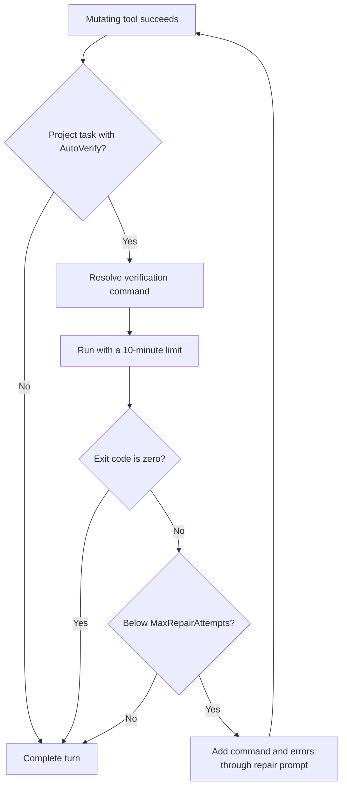

# Build Verification and Automatic Repair

After a mutating tool succeeds in a project task, the Agent runs `BuildVerifier` before completing its answer. A failed verification appends the command and error output through the `builtin/repair` prompt in the same Session and continues within the configured repair limit.

## Flow



Global tasks never run build verification. `plan` and `readonly` do not expose mutating tools and therefore cannot trigger it.

## Default commands

| Detected kind | Current default command |
| --- | --- |
| .NET | `dotnet build --nologo -v q` |
| Rust | `cargo check --quiet` |
| Go | `go build ./...` |
| Node | `npm run build` only when `package.json` contains a `build` script |

Python and Unity currently have no built-in default command. Configure a workspace override when verification is required.

## Configuration

Global `~/.seekclaw/config.json`:

```json
{
  "agent": {
    "autoVerify": true,
    "maxRepairAttempts": 3
  }
}
```

Workspace `.seekclaw/config.json`:

```json
{
  "autoVerify": true,
  "verifyCommand": "dotnet test"
}
```

`verifyCommand` is a workspace field, not a global `agent.verificationCommand`. Commands run from the workspace root. Windows prefers Bash, then PowerShell, and finally `cmd.exe`; other systems use `/bin/bash -c`.

Standard output and error are combined. When output exceeds 8,000 characters, the verifier keeps the end because compiler errors usually appear there. Verification events are rendered in Desktop or CLI, and reaching the repair limit stops the loop while preserving the actual failure details.
