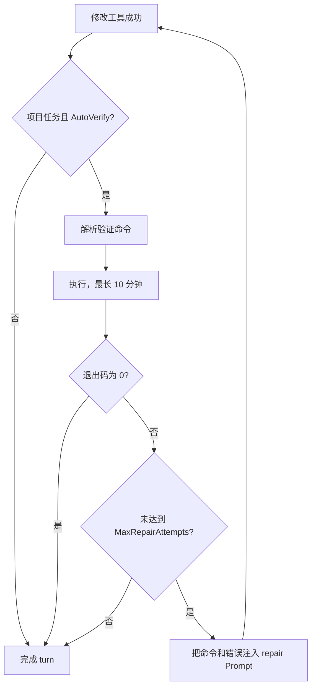

# 构建验证与自动修复

当项目任务中的修改工具成功执行后，Agent 在准备完成回答前运行 `BuildVerifier`。验证失败会把命令与错误输出作为 `builtin/repair` Prompt 追加到同一 Session，并在限制内继续修复。

## 流程



不绑定项目的任务不会运行构建验证。`plan` / `readonly` 模式没有修改工具，因此也不会触发。

## 默认命令

| 检测类型 | 当前默认命令 |
| --- | --- |
| .NET | `dotnet build --nologo -v q` |
| Rust | `cargo check --quiet` |
| Go | `go build ./...` |
| Node | 仅当 `package.json` 包含 `build` script 时运行 `npm run build` |

Python 与 Unity 当前没有内置默认验证命令，可通过工作区覆盖设置。

## 配置

全局 `~/.seekclaw/config.json`：

```json
{
  "agent": {
    "autoVerify": true,
    "maxRepairAttempts": 3
  }
}
```

工作区 `.seekclaw/config.json`：

```json
{
  "autoVerify": true,
  "verifyCommand": "dotnet test"
}
```

`verifyCommand` 是工作区字段，不是全局 `agent.verificationCommand`。命令在工作区根目录执行；Windows 优先使用 Bash，其次 PowerShell，最后 `cmd.exe`，其他系统使用 `/bin/bash -c`。

标准输出与标准错误会合并，超过 8,000 字符时保留末尾内容，因为编译器错误通常位于末尾。验证事件会同步显示在 Desktop 或 CLI；达到修复次数后结束循环并保留真实失败信息。
