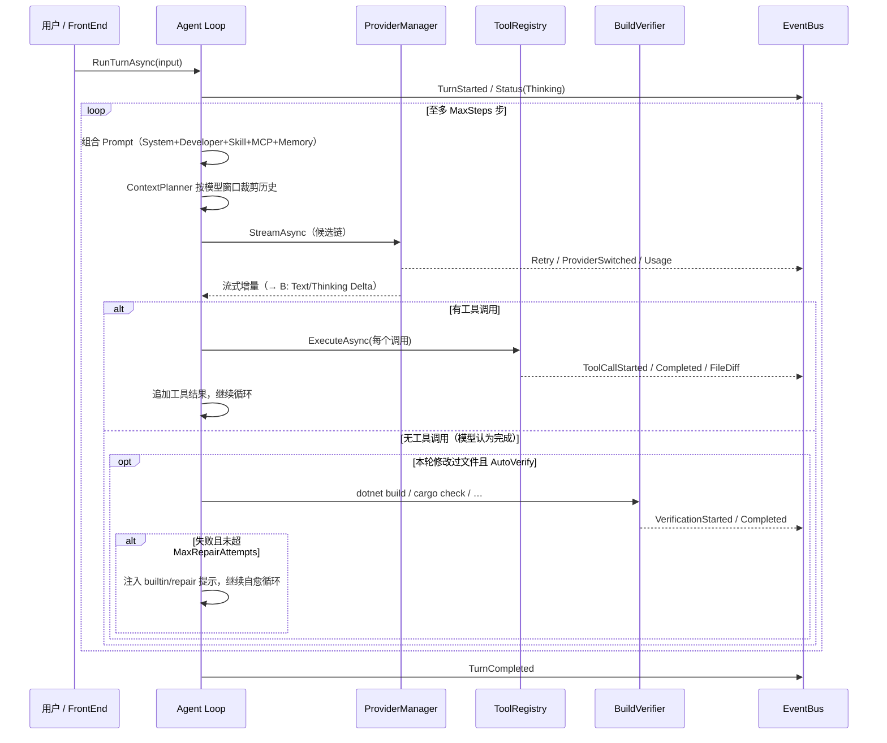

# 架构设计与 Runtime First 原则

SeekClaw 的核心设计遵循 **Runtime First** 原则与**清洁架构（Clean Architecture）**。本文将深入讲解 SeekClaw 的模块切分、事件驱动机制、双缓冲游戏式终端渲染引擎与 Agent 生命周期。

---

## 总体架构图

```
+-----------------------------------------------------------------------+
|                            前端表示层 (Frontends)                       |
|   +---------------------------------+   +-------------------------+   |
|   | seekclaw_cli (System.CommandLine)|   | GUI / Web / IDE 插件    |   |
|   +---------------------------------+   +-------------------------+   |
+------------------------------------|----------------------------------+
                                     |  (Daemon IPC / Direct Facade)
+------------------------------------v----------------------------------+
|                      SeekClaw Core Runtime (seekclaw_runtime)         |
|                                                                       |
|   +---------------------------------------------------------------+   |
|   | SeekClawRuntime (Facade 组合根)                                |   |
|   +---------------------------------------------------------------+   |
|                               |                                       |
|   +---------------------------v-----------------------------------+   |
|   |                       Agent 主循环 (Agent Loop)               |   |
|   +---------------------------------------------------------------+   |
|         |                     |                    |                  |
|   +-----v-------+     +-------v------+     +-------v------+           |
|   | EventBus    |     | Provider     |     | ToolRegistry |           |
|   | (Channel)   |     | Manager      |     | (Plugins)    |           |
|   +-------------+     +--------------+     +--------------+           |
|         |                     |                    |                  |
|   +-----v-------+     +-------v------+     +-------v------+           |
|   | Terminal    |     | MCP Manager  |     | Build        |           |
|   | Renderer    |     | (stdio/SSE)  |     | Verifier     |           |
|   +-------------+     +--------------+     +--------------+           |
+-----------------------------------------------------------------------+
```

---

## Runtime First 理念

1. **关注点分离**：业务逻辑、LLM 路由、上下文剪裁、工具执行、会话存储与代码构建校验全部内聚于 `seekclaw_runtime` 模块。
2. **零 Console 侵入**：`seekclaw_runtime` 中的任何底层类（如 ProviderManager、ToolRegistry）**一律严禁直接调用 `Console.WriteLine`**。所有的状态变更均通过 `IEventBus` 发布强类型事件。
3. **多端适配**：当前 `seekclaw_cli` 是默认终端前端；未来 GUI、Web 或 IDE 插件可通过相同的 `SeekClawRuntime` Facade 或 Daemon IPC 协议直接无缝对接。

---

## 游戏式终端渲染架构 (Double-Buffered Live Region)

为了在终端界面中呈现 30-60 FPS 的流畅视觉效果并杜绝传统 CLI 的屏幕闪烁与滚屏乱码问题，SeekClaw 引入了游戏引擎式的双缓冲刷新模型：

```
Agent 业务线程  ---> [Publish] --->  IEventBus (System.Threading.Channels)
                                           |
                                    [Subscribe]
                                           v
                             TerminalRenderer 渲染线程 (~30-60 FPS)
                                           |
                                 [每帧事件合并 Coalesce]
                                           |
                                           v
                             ANSI LiveRegion 双缓冲合并写入 Terminal
```

### 渲染控制要点：
- **静态屏 (Scrollback)**：已完成的交互历史、最终生成的代码与卡片直接推入控制台 Scrollback。
- **Live 动态区 (Live Region)**：底部的流式思考（Thinking Delta）、工具执行进度条（Spinner）、正在打字输出的内容与底栏状态实时在 Live 区域覆盖刷新。
- **优雅响应 Ctrl+C**：第一次按下 Ctrl+C 安全取消当前正在运行的 Agent 任务；2 秒内第二次按下或空闲状态下退出程序。

---

## Agent Turn 生命周期与 Sequence 流程

一个 Turn（回合）从用户提交提示词到返回最终结果的执行图解：



---

## 核心接口定义

在 `seekclaw_runtime` 中，核心组件均通过依赖注入接口解耦：

- `IEventBus`：基于 `System.Threading.Channels` 的发布订阅总线。
- `IProviderManager`：智能路由、模型解析、多级候选链与熔断降级。
- `IToolRegistry`：动态注册与调度所有原生工具与 MCP 工具。
- `IPromptProvider`：支持 Prompt 模板的文件加载、变量替换与热更新。
- `IWorkspaceManager`：感知当前项目的架构工具链并初始化 Memory。
- `IVerifier`：项目代码编译与测试验证引擎。
