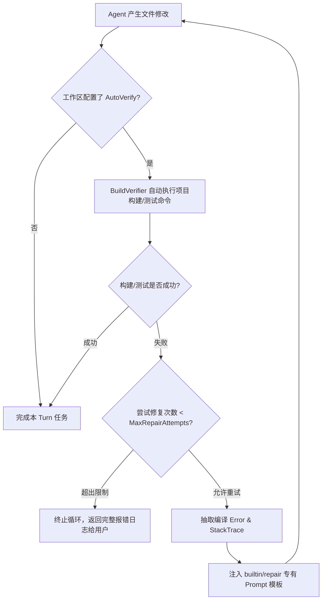

# 构建验证与自动自我修复 (Build Verification & Auto-Repair)

传统的 AI 编码助手最常见的问题是："看似修改了代码，但生成的内容包含语法错误或破坏了现有的单元测试，需要人工打断并手工修错"。

SeekClaw 引入了 **BuildVerifier 闭环与自愈修复循环（Auto-Repair Loop）**。

---

## 自愈闭环工作流



---

## 验证策略配置选项

全局或工作区 `.seekclaw/config.json` 中可配置自愈参数：

```json
"agent": {
  "autoVerify": true,
  "maxRepairAttempts": 3,
  "verificationCommand": "dotnet build seekclaw_tests"
}
```

### 自动识别逻辑：
如果未显式提供 `verificationCommand`，SeekClaw 会根据 `WorkspaceManager` 检测到的项目类型智能推导默认验证命令：
- `.NET`: `dotnet build`
- `Rust`: `cargo check`
- `Node.js`: `npm run build` 或 `pnpm run check`
- `Python`: `pytest`

---

## 防幻觉与无掩盖原则

SeekClaw 的 `BuildVerifier` 遵循严肃的技术规范：

- **拒绝静默吞异常**：如果构建超时或报错，必须完整提取编译器打出的标准错误输出 (stderr) 与绝对行号。
- **专有 Repair 提示**：自愈 Prompt 中包含精确指令，禁止 Agent 通过删除单元测试、注释断言或返回伪装 Dummy 数据来“掩盖”构建失败。
- **有界退避**：达到 `MaxRepairAttempts`（默认 3 次）后立即停止，向开发者呈现真实的错误上下文，避免死循环消耗 Token。
